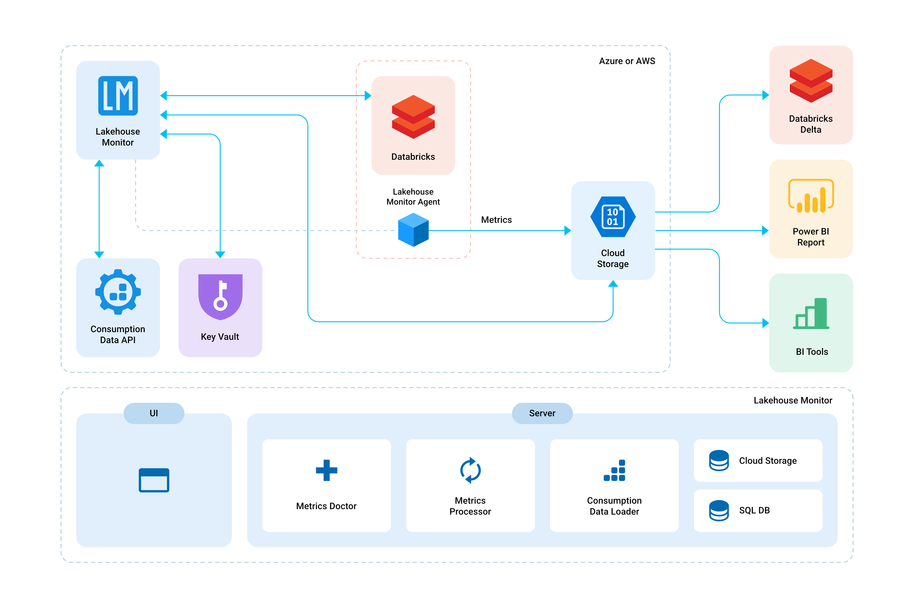

# Azure App Service Deployment

## Azure Resources 

After the deployment of the Lakehouse Monitor is complete, the provided resource group will include the following resources: 

**AppService**: includes the reporting and instrumentation dashboard, background services for telemetry data analysis and recommendations, as well as consumption data scheduled runs 

**Storage Account**: used for storing all telemetry data from the Databricks workspaces and consumption/cost/usage detail data 

**KeyVault**: used for storing the storage account access key, the Azure AD App Registration client secret as well as the token store sas uri secret 

Signing into the application url is done through Azure AD credentials that are authorized for access into all available subscriptions in the Azure tenant and all the Databricks workspaces in the available subscriptions.

## Sign-in user requirements 

The user who installed Lakehouse Monitor as an AppService is assumed to already have User Access Administrator role. This role is required to configure the following required roles for managed identity from Azure Portal. 

Each **signed-in Azure AD user** must have following permissions in order use (e.g. to attach/detach the telemetry data collector) on Databricks resources(e.g. jobs, clusters): 

* Microsoft.Databricks/workspaces/read permission via a custom role at either Azure subscription or resource group level containing the Databricks workspaces this user should be able to access from the application provide the above role from Azure Portal by configuring either the Azure subscription or the resource group 

* A Databricks user must be created in the Workspace/Settings/Admin Console/Users for the signed in Azure AD user. The app does not create them automatically as it would require a higher privilege for the signed in user.  

    * The Databricks user’s permission will dictate the level of access to resources. If the workspace is part of the Premium tier, more granular access control can be enabled, and the “Can Manage” permission is required for this user to change cluster or job configuration.  

    * For non-Premium workspaces, any Databricks user can edit configurations, the one exception is All Purpose clusters they can be only edited by their Owners, since we introduced Databricks secrets in configuration. 