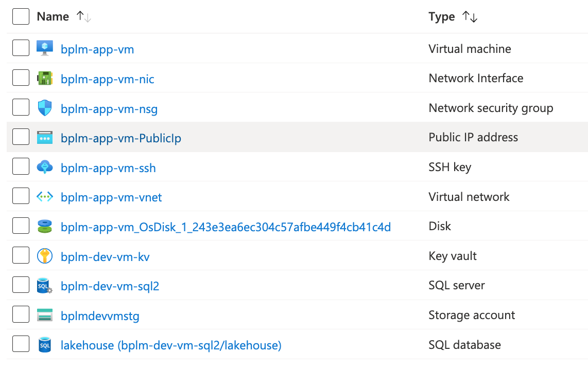

# Azure VM Script Deployment

1. Download the deployment script (zip format) [here](bplm-vm-deploy.zip)

2. In the Azure portal, create a resource group for your deployment, in the same region as the Databricks workspaces you will monitor

3. Open up a PowerShell Cloud Shell (not Bash) in the Azure portal and upload the bplm-vm-deploy.zip to your folder

4. Unzip using: `unzip arm-vm.zip`

5. cd into the directory: `cd arm-vm`

6. Create a params object to configure the deployment, values below are optional
   ```
   $paramsBP = @{
   
    VirtualMachineSize = 'Standard_B4ms'
    DNSPrefix = 'your choice of DNS prefix goes here'
    VirtualMachineName = 'if you want a specific name, default is bplm-app-vm'
    }
    ```
7. Run the script (omit the @paramsBP part if you haven’t changed the defaults).
   
   `./vmdeploy.ps1 @paramsBP`

8. You will be prompted for the name of the resource group you just created at step 2, subscription id, BaseApplicationName is the name of the Azure AD App Registration that is going to be registered for SSO into the application. 

9. Once the deployment is complete you will find your ssh private key in your ~/.ssh folder in cloud shell

10. The deployment script creates the following resources in the provided resource group


11. Copy over necessary files to the VM, in a new folder of your choice:

    a. docker-compose.yaml (download [here](docker-compose.yml))

    b. .env file (rename the envContent.txt from your cloud shell folder to .env before you copy) 

    c. setup.sh

12. edit setup.sh on the VM and provide the FQDN, then run setup.sh 

13. edit .env file with the configuration of the created SSL certificates (Certbot)

14. run `docker login -u bplm-acr-token blueprint.azurecr.io` - password provided at deployment time by Blueprint

15. run `docker-compose up -d`

16. use the FQDN from step 11, access url via https://FQDN
